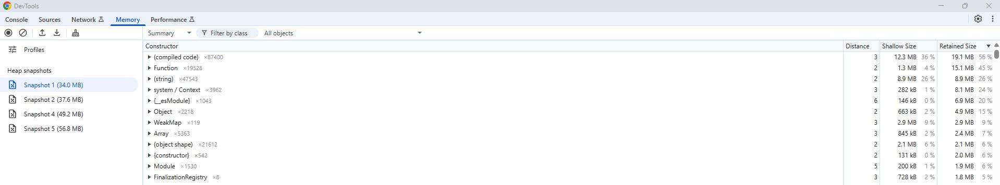
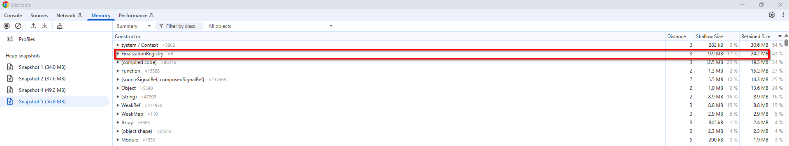
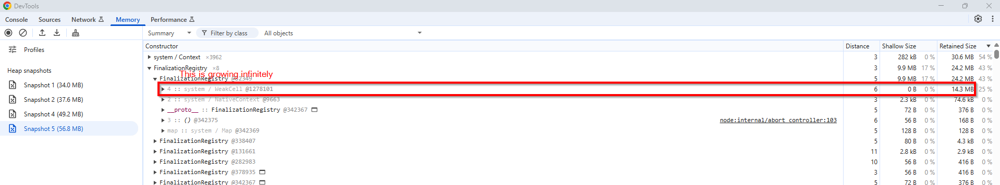

# Memory Leak in Finalization registry

Run `npm run install`
In one terminal run `node server.js` to start a dummy server.
In a second terminal run `npm run start-gateway` to start the gateway.
In a third terminal run `k6 run k6_test.js`

Inspect the size of FinalizationRegistry in memory, which is constantly growing and not garbage collected.
Initially:

After about 20 minutes:

Growth in Finalization Registry:
